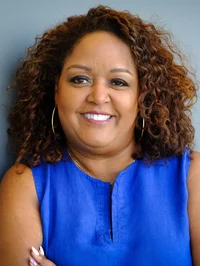

::: {style="text-align: center; color: #337DFF;"}
# IRE and Merrill College Data Journalism Training

### Dow Jones News Fund \@ Merrill College

#### Sunday, June 1 - Saturday, June 8, 2025
:::

<br>  

::: {style="text-align: center;"}
  

  

:::

::: {style="font-weight:bold;"}
``` markdown
Rob Wells, director
David Herzog, co-director
Karen Denny, co-director  
Aidan Hughes, assistant  
```
:::

::: {style="text-align: center; color: #337DFF;"}
# Itinerary
:::

**Pre-Conference**

-   **By May 26**: Students will have [data assignments
    described](https://docs.google.com/document/d/1A-dlzWX7ksOt6LRHYpuPDk7SPPWxyZEmGt2wC0lM7Mg/edit).
-   **By May 26**: Students will be sent a data starter kit to load
    relevant software on their laptops and test out their equipment.
-   **Due Thursday May 29, 11:59 p.m.**: Students profiles due.

**Sunday, June 1, 2025**

-   **2 p.m.**: Welcome at Knight Hall Eaton Theater. Wells, Herzog,
    Denny, Hughes and Shirley Carswell, DJNF Executive Director
    -   Logistics. The week ahead. Rooms meals.
    -   Student introductions.
-   **3:30 p.m.**: Use data to find stories.
    -   Spreadsheet track: Herzog. Eaton Theater  
    -   Coding track: Wells. Room 1109
-   **4:30 p.m.**: Break and then independent work
    -   [Students review data
        memos](https://docs.google.com/document/d/1A-dlzWX7ksOt6LRHYpuPDk7SPPWxyZEmGt2wC0lM7Mg/edit)
        for their assigned communities. Produce draft story ideas by
        11:59 p.m.
-   **5:30 p.m.**: Break
-   **6:30 p.m.**: Dinner in Hyattsville - Busboys & Poets. (Meet at
    Knight Hall board van)
-   **11:59 p.m.**: Produce one paragraph draft story ideas by 11:59
    p.m., emailed to Wells

**Monday, June 2, 2025**

-   **Breakfast**: On your own at dorm

-   **9 a.m.**: Meet at Knight Hall

-   **Skills sessions. Pick one**    

    -   Coding Track: Data Driven Reporting. (Sean Mussenden, the Howard Center)
        -   Bring material into R and make sense of it.
        -   Basic webscraping, PDF data extraction
        -   Knight Hall Room 2103
        
    -   Spreadsheet Track: Pivot Tables. (Herzog, IRE) 
        -   A powerful tool to summarize data         
        -   Knight Hall Room 2105 
        

-   **10:30 a.m.**: Break. Coffee served. Lobby. 

-   **11 a.m.**: Workshops: Use data to find stories. (Wells, Mussenden, Herzog).
    Rooms 2103, 2105

-   **12:30 p.m.**: Lunch in Knight Hall.

    -   Speaker: TBA

-   **1:30 p.m.**: Writing a story pitch memo. All attend. (Denny). Room 2103

    -   [Slides for
        talk](https://docs.google.com/presentation/d/1zdlk2Ss9jE_SZL2HuHvUbZeUteEO0OBasFKpXtjuZIY/edit?usp=sharing)


-   **2:15 p.m.**: Using GitHub. All attend. (Mussenden) [GitHub
        refresher](https://wellsdata.github.io/data_journalism_class/_book/github.html)

-   **2:45 p.m.**: Workshop for [story pitch memo due at 11:59
    p.m.](https://docs.google.com/document/d/1A-dlzWX7ksOt6LRHYpuPDk7SPPWxyZEmGt2wC0lM7Mg/edit)
    (Wells, Denny, Herzog, TA coach). Rooms 2103, 2105

-   **4 p.m.**: Diversity is Good Journalism: Covering All of the Community. (Prof.
    Christoph Mergerson). All attend. Room 2103
    
    -   [Readings before
        talk](https://drive.google.com/drive/folders/1VjenaNF-IahhdVl6TQHrQK5_ygELl2JD?usp=drive_link)

-   **5:30 p.m.**: Break

-   **6:30 p.m.**: Dinner on campus or TBA

-   **11:59 p.m.**: [Draft story pitch
    memo](https://docs.google.com/document/d/1A-dlzWX7ksOt6LRHYpuPDk7SPPWxyZEmGt2wC0lM7Mg/edit),
      emailed to Wells and Herzog.


**Tuesday June 3, 2025**

-   **Breakfast**: On your own at dorm
-   **9 a.m.**: Data Visualization. Using Datawrapper for data
    visualization. (Adam Marton). All attend. Room 2103
-   **10:30 a.m.**: Break. Coffee served.
    -   Heather Taylor, manager of digital media and programs, Dow Jones
        News Fund.
-   **11 a.m.**: Workshop. Students work on R data gathering story
    pitches. (Wells, Marton, TA as coaches). Room 1101
-   **11:45 p.m. - 12:45 p.m.**: Keynote speaker: [Cheryl Thompson, NPR, Senior Editor, Member Station Investigations](https://www.npr.org/people/705265133/cheryl-w-thompson). All attend. Eaton Theater.  
    -  [Readings before Cheryl Thompson talk](https://docs.google.com/document/d/1P6RsrtnL0TJY0-jOc3QzAR8XFifecfQQSO5GTp0kRfA/edit?usp=sharing) 
-   **12:45 p.m. - 1:30 p.m.** Lunch with Cheryl Thompson. Sandwiches served in Knight Hall.

-   **1:30 p.m. - 2:30 p.m.: Skills sessions**

    -   Coding Track: Using AI with R. (Derek Willis, the Howard Center)
        -   Use R to link to a LLM and process data.
        -   Knight Hall Room 2103
        
    -   Spreadsheet Track: Data cleaning. (Herzog, IRE) 
        -   Use Google Sheets, Open Refine to clean data
        -   Knight Hall Room 2105 

-   **2:45 p.m.-3:45 p.m. **   
    -   Mapping. Herzog. All attend.
        -   Make a map in Datawrapper.   
        -   Knight Hall Room 2103

-   **3:45 p.m.**: Workshop  
    (Wells, Denny, Herzog, Lang coach). Rooms 2103, 2105

-   **5:30 p.m.**: Break
-   **6:30 p.m.**: Dinner in Hyattsville - Franklins. (Meet at Knight
    Hall board van)

**Wednesday June 4, 2025**

-   **Breakfast**: On your own at dorm
-   **9 a.m.-10:15 a.m.: Skills sessions**

    -   Coding Track: Using AI with R. (Daniel Trielli, Merrill College)
        -   Use R to link to a LLM and process data.
        -   Knight Hall Room 2103
        
    -   Spreadsheet Track: File Types and Metadata. (Herzog, IRE) 
        -   Use Microsoft Visual Studio to identify file types
        -   Knight Hall Room 2105 

-   **10:15 a.m.**: Break. Coffee served.
-   **10:30 a.m.**: Workshop. Open workshop on projects. (Wells, Herzog, Lang coach). Rooms 2103, 2105
-   **12 p.m.**: Lunch in Knight Hall.
    -   Brief remarks by Alex Pyles, Associate Dean, Academic Affairs,
        Philip Merrill College of Journalism
-   **1 p.m. - 2:30 p.m.**: Jeannine Aversa, U.S. Census Bureau or
    Bureau of Economic Analysis, localizing stories with BEA data. All attend. Eaton
    Theater
    -   Exercise using BEA economic data for your community. 
-   **2:30 p.m. - 2:45 p.m.**: Break
-   **2:45 p.m. - 3:45 p.m.** Connie Mitchell Ford on business reporting. All attend. 
    Room 2103
    -   Three ways to get business and economic data and how to localize
        it.
-   **3:45 p.m.**: Workshop. Connie Mitchell Ford workshop on project
    proposals. (Wells, Lang, Herzog as coaches). Room 2103, 2105
-   **5 p.m.**: Break
-   **6:30 p.m.**: Dinner on campus
-   **11:59 p.m.**: [Second draft of story pitch memos
    due](https://docs.google.com/document/d/1A-dlzWX7ksOt6LRHYpuPDk7SPPWxyZEmGt2wC0lM7Mg/edit),
    emailed to Wells and Herzog.

**Thursday June 5, 2025**

-   **Breakfast**: On your own at dorm
-   **8:30 a.m.**: Meet at Knight Hall, board van, depart for College
    Park Metro
-   **10:00 a.m.**: Tour U.S. Capitol press galleries with TBA.
-   **Noon**: Lunch in the U.S. Capitol. Meeting with other journalists.
-   **2 p.m.**: Tour of TBA D.C. bureau. 
-   **3:30 p.m.**: Open to explore D.C. or join Wells for an adventure
-   **6 p.m.**: Dinner in Washington D.C.: Ben’s Chili Bowl

**Friday June 6, 2025**

-   **Breakfast**: On your own at dorm
-   **9 a.m.: Gathering Public Records**
    - All attend. (Herzog and Wells). room 2103
-   **10:00 a.m. - 10:15 a.m.**: Break
-   **10:15 a.m.**: Public records exercise. (Wells, Herzog, Lang coach)
-   **11:00 a.m.**: Skills to survive in the newsroom. Time management, deadlines. All attend. (Denny) Room 2103.
-   **12 p.m.**: Lunch in Knight Hall.
    -   Speaker: Prof. Kevin Blackistone on racial justice in sports
        business
-   **1 p.m.**: Workshop on projects (Wells, Herzog, Denny, Lang coach)
-   **3:30 p.m.**: Meet at Knight Hall, board van, depart for College
    Park Metro, dinner in Washington D.C., attend a community jazz show
    at [Westminster Church](https://westminsterdc.org/our-pastor). Meet
    with TBA beforehand to discuss Southwest D.C.
    history

**Saturday June 7, 2025**

-   **Breakfast**: On your own at dorm
-   **10:00 a.m.**: [Students present web
    pages](https://docs.google.com/document/d/1A-dlzWX7ksOt6LRHYpuPDk7SPPWxyZEmGt2wC0lM7Mg/edit),
    story pitches, solicit feedback. Shirley Carswell, DJNF Executive
    Director, visits
-   **12:15 p.m.**: Lunch in Knight Hall
-   **1 p.m.**: On the van for D.C.
-   **2:30 p.m.**: Tour of African-American History Museum, D.C.
-   **5:30 p.m.**: Dinner in Riverdale, La Fantome Food Hall (Meet at
    Knight Hall board van)

**Sunday June 8, 2025**

-   Breakfast available at Yahentamitsi Dining Hall.
-   Depart on your own schedule

::: {style="text-align: center; color: #337DFF;"}
# Instructors
:::

**Kevin Blackistone**


Kevin Blackistone is a longtime national sports columnist now at The
Washington Post, a panelist on ESPN’s “Around the Horn,” a contributor
to National Public Radio and coauthor of “A Gift for Ron,” a memoir by
former NFL star Everson Walls published in November 2009 that details
his kidney donation to onetime teammate Ron Springs.

Blackistone was a sports columnist for AOL Fanhouse from October 2007 to
March 2011 and an award-winning sports columnist for The Dallas Morning
News from September 1990 to September 2006.

Blackistone is a recipient of numerous awards, including awards for
sports column writing from the Texas Associated Press Managing Editors,
for investigative reporting from the Chicago Newspaper Guild and for
enterprise reporting from the National Association of Black Journalists.


**Karen Denny**


Karen Denny is Merrill College's director of internships and career
development. She previously served as the Annapolis bureau director of
the Capital News Service, until taking over leadership of the career
center at the beginning of 2022. Denny is a former editor with the
McClatchy-Tribune (formerly Knight Ridder/Tribune) News Service, where
she founded the wire’s Newsfeatures and International sections, and most
recently was a features editor.

She previously worked as the Maryland editor for The Washington Times,
and at the suburban Journal Newspapers as an editor and local government
reporter. She also served as a professor at Sang Ji University in Won
Ju, South Korea.    

**David Herzog**  


David Herzog is a veteran investigative reporter, data journalist and educator with more than 30 years of experience. He enjoys discovering how journalists can use data analysis tools to uncover the news better. Herzog teaches data journalism to student and professional journalists. He speaks frequently about investigative reporting, data journalism and access to information.

As the academic adviser to the National Institute for Computer-Assisted Reporting, he helps guide data services for Investigative Reporters and Editors. IRE is a global organization with more than 5,000 members based at the Journalism School. He helps direct the Dow Jones News Fund’s data journalism residency program for IRE.

He is part of the interdisciplinary team that launched the online M.S. in Data Science and Analytics program at the University of Missouri. He developed and teaches a data journalism class geared toward professionals for the program.

He’s reported for The Providence Journal, The Baltimore Sun, and The Morning Call in Allentown, Pa. He’s won or shared in national, regional and state awards for investigations into political corruption, child lead poisoning and lax workplace safety.

**Adam Marton**


Adam Marton is an award-winning journalist and graphic designer who
joined the Philip Merrill College of Journalism in 2018 after 13 years
at The Baltimore Sun.

Marton is focused on quality storytelling across media, using design and
technology to tell rich, human stories. He is a visual journalist and
designer specializing in the presentation of the news, including data
visualization, front-end development and information graphics.

**Constance Mitchell Ford**


Constance Mitchell Ford, a 1977 University of Maryland graduate, is a
financial journalist who spent more than three decades covering
economics, banking, investing and real estate.

Most of those years were spent at The Wall Street Journal in New York,
most recently as the Global Real Estate and Property Bureau Chief. Under
her leadership, reporters in the real estate group won dozens of
journalism awards. Ford personally received the Scripps Howard National
Journalism Award for business and economics reporting in 2007 for
stories about the subprime mortgage crisis.

**Sean Mussenden**


Sean Mussenden, a former Washington correspondent, is the data editor
for the Howard Center for Investigative Journalism. He previously
oversaw an experiential, hands-on journalism training program at Merrill
College that is integral to the college’s “teaching hospital” model of
professional instruction: Capital News Service.

He also teaches traditional courses incorporating data visualization,
programming, web development, web design, data analysis, social media
and computational journalism. Mussenden was appointed to the rank of
principal lecturer in 2023.

**Bridget Lang**


Bridget Lang is a software developer for the University of Maryland. In 2024, 
she earned her bachelor’s degree in computer science with an upper-level 
concentration in journalism. A Baltimore County native, Lang uses her skills in 
software development, data, and writing to tell stories in the best way 
possible. She has had articles published in the Baltimore Banner and Capital 
News Service and is assisting Wells on a research project about an influential
conservative journalist. 

**Christoph Mergerson**


Christoph Mergerson, who completed his Ph.D. in Communication,
Information and Media at Rutgers University, joined the Philip Merrill
College of Journalism in Fall 2021 as a visiting assistant professor. He
was appointed to the rank of assistant professor in Fall 2022.

Mergerson's research and teaching interests include journalism history,
weather journalism, race and media, and journalism and democracy.
Mergerson arrived at Merrill with ongoing research that examines whether
news media in the Southern United States are producing racially
inclusive, public-service journalism. He brings award-winning classroom
experience from teaching courses at Rutgers, including Communication Law
and Global News.

**Daniel Trielli**


Daniel Trielli joined the Philip Merrill College of Journalism's faculty
in Fall 2023 as assistant professor of media and democracy.

He researches the impact of algorithmic curation on journalism and
political information, and studies how Google affects the news and the
audiences that use it to search. He is interested in data and
computational journalism, media literacy and algorithmic accountability.
Trielli came to Merrill College as a master's student in 2015 after a
10-year career as a journalist in Brazil at the national newspaper, O
Estado de S. Paulo, and the regional newspaper, Diário do Grande ABC.

**Rob Wells**


Rob Wells, a 2016 Ph.D. alum of Merrill College, returned to the
university in the Spring 2022 semester after more than five years at the
University of Arkansas, where he rose to the rank of associate professor
and led Arkansas' journalism graduate program. Wells has more than two
decades of business journalism experience at The Associated Press,
Bloomberg News and The Wall Street Journal.

Wells is the author of “The Enforcers: How Little-Known Trade Reporters
Exposed the Keating Five and Advanced Business Journalism” (2019) and
"The Insider: How the Kiplinger Newsletter Bridged Washington and Wall
Street" (2021).


**Derek Willis**


Derek Willis, one of the nation’s leading data journalists and an
experienced educator, joined the Philip Merrill College of Journalism in
Fall 2021 as a lecturer in data and computational journalism.

Willis came to Merrill College having spent 25 years winning awards at
some of the top news outlets in the country. His latest stop was
ProPublica, where he served as a news applications developer since 2015.

He previously held interactive journalism roles with The New York Times
and The Washington Post, after working as a database reporter for The
Washington Post, The Center for Public Integrity, Congressional
Quarterly and The Palm Beach Post.


::: {style="text-align: center; color: #337DFF;"}
# Guest Speakers
:::

**Cheryl Thompson**



Cheryl W. Thompson is an investigative correspondent for NPR and senior editor overseeing Member station investigations.

Since becoming the inaugural editor of the stations investigations team in 2021, where she is a player/coach, she has collaborated with Member stations in Texas, California, Georgia, Illinois, Kentucky, Missouri, Montana, Oregon and Washington, and with Columbia University and several nonprofits, to do award-winning work, including "Hot Days: Heat's Mounting Death Toll on Workers in the U.S.," an investigation into how Black and brown workers in the U.S. were dying on the job for lack of water and shade breaks. That series won several awards in 2022, including an IRE and National Headliner. An examination of racial covenants still on the books throughout the U.S. won a National Headliner award and an award from the National Association of Black Journalists. An investigation into deaths at tribal jails won awards from PMJA and the Native American Journalists Association. And an investigation into ballot drop boxes in Georgia after the 2020 presidential election won a 2023 NABJ award.

She also served as the investigative reporting coach on the No Compromise podcast that won the 2021 Pulitzer Prize for Audio Reporting. That same year, NPR honored her with the Public Service Journalism award given annually to one journalist. She served as a Pulitzer juror for investigative reporting in 2022 and chaired the jury in 2023.

Prior to joining NPR in January 2019, Thompson spent 22 years at The Washington Post, where she wrote extensively about law enforcement, political corruption and guns, and was a White House correspondent during Barack Obama's first term. Her investigative series that traced the guns used to kill more than 500 police officers in the U.S. earned her an Emmy, a National Headliner, an IRE, a White House News Photographers Association and other awards. In 2015, her reporting found that nearly one person a week died in the U.S. after being Tasered by police. The story was part of a yearlong series on police shootings in the U.S. that won the Pulitzer Prize for national reporting.

In 2017, her examination of Howard University Hospital revealed myriad problems with the storied facility, including that it had a higher rate of death lawsuits per bed than the five other D.C. hospitals. Her project published in the Washington Post Sunday Magazine in May 2018 investigated the unsolved serial murders of six Black girls in the nation's capital nearly 50 years ago; it later won an SPJ DC award for magazine feature writing and an NABJ award for investigative reporting. She has won numerous other national awards, and was named NABJ's Educator of the Year in 2017 for her teaching and mentoring at George Washington University. She was part of the Washington Post team that won the Pulitzer Prize for national reporting in 2002 for coverage of Sept. 11.

Thompson is the past president of Investigative Reporters and Editors, a 6,000-member organization whose mission is to improve the quality of investigative journalism. In 2018, she became the first Black elected president in its 43-year history and served for three terms before being elected board chairman in 2021. She also teaches investigative reporting as an associate professor at GWU, where she founded a student NABJ chapter in 2014, and is a member of Alpha Kappa Alpha Sorority, Inc.


**Jeannine Aversa**


Jeannine Aversa is chief of communications at the U.S. Bureau of
Economic Analysis, one of the world's leading statistical agencies.
Before joining BEA in the fall of 2011, [Aversa was a journalist for
nearly 30
years](https://talkingbiznews.com/they-talk-biz-news/economics-reporter-joins-bureau-of-economic-analysis/)
and reported for The Associated Press, Bloomberg News, Fairchild
Publications and other news organizations. For more than a decade,
Aversa’s coverage focused on economics, monetary policy, finance and
politics. She holds a bachelor’s degree in journalism from the
University of Missouri at Columbia.


::: {style="text-align: center; color: #337DFF;"}
# DJNF Data Interns
:::

**TBA**


TBA
TBA
TBA

::: {style="text-align: center; color: #337DFF;"}
# Resources
:::

**Campus Map**


<br> **Data Journalism Text**

[Data Journalism with R and the
Tidyverse](https://wellsdata.github.io/data_journalism_class/_book/)

<br>

### Important Contacts

<br>

**Rob Wells, 443-591-1189. email:
[robwells\@umd.edu](mailto:robwells@umd.edu){.email}**

<br>

**David Herzog, TBA. email:
[herzogd\@missouri.edu](mailto:herzogd@missouri.edu){.email}**

<br>

**Karen Denny, TBA. email:
[kdenny12\@umd.edu](mailto:kdenny12@umd.edu){.email}**

**Residence Halls & Campus**

<div>

-   Jennifer Bradley Senior Program Manager Office:301-314-0323 Mobile:
    301-440-9276 Email:
    [jarsen17\@umd.edu](mailto:jarsen17@umd.edu){.email}

-   Rakshanda Hedawoo Assistant Program Manager Mobile: 301-440-9277
    Email: [rhedawoo\@umd.edu](mailto:rhedawoo@umd.edu){.email}

-   Queen Anne’s Hall (For mail/key/access-related questions):
    301-314-4455 (HILL)

-   Residential Facilities (To report an issue with your room/residence
    hall) 301-314-9675 (WORK) Campus Information 301-405-1000

</div>

**Medical/Emergency Contacts**

<div>

-   Emergency (University of Maryland Police) 301-405-3333
-   Emergency (Prince George’s County Police) 911
-   Non-Emergency (University of Maryland Police) 301-405-3555
-   University Health Center 301-314-8180

</div>
